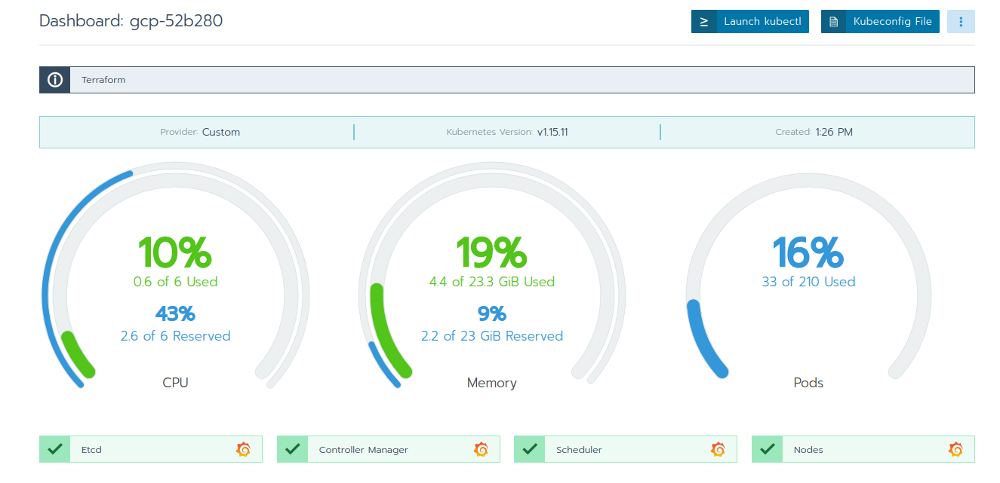
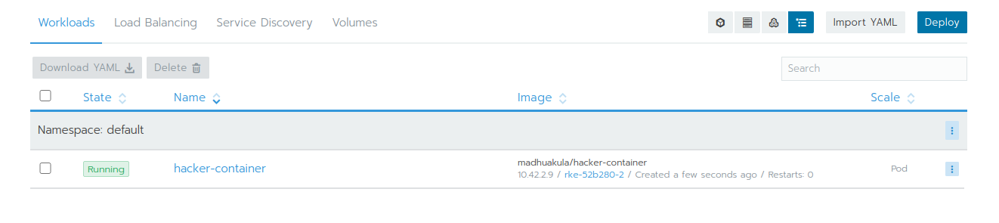

# Flannel BTS

[Flannel](https://github.com/coreos/flannel) is a well-established overlay network and provides a pure Layer 3 network fabric for Kubernetes clusters.

We will have a quick look behind the scenes on a cluster based on [RKE](https://rancher.com/products/rke/).

Let's first create a three-node cluster on GCP using [Rancher](https://rancher.com/):

 

To keep things simple, all three nodes have all roles (etcd, controlplane, worker) and are based on [Ubuntu 18.04 LTS](https://releases.ubuntu.com/18.04/):

```
(2488)system:/home/demo>kubectl get nodes -o wide
NAME           STATUS   ROLES                      AGE   VERSION    INTERNAL-IP    EXTERNAL-IP   OS-IMAGE             KERNEL-VERSION   CONTAINER-RUNTIME
rke-52b280-0   Ready    controlplane,etcd,worker   72m   v1.15.11   10.240.0.101   <none>        Ubuntu 18.04.4 LTS   5.3.0-1030-gcp   docker://18.6.3
rke-52b280-1   Ready    controlplane,etcd,worker   68m   v1.15.11   10.240.0.102   <none>        Ubuntu 18.04.4 LTS   5.3.0-1030-gcp   docker://18.6.3
rke-52b280-2   Ready    controlplane,etcd,worker   68m   v1.15.11   10.240.0.103   <none>        Ubuntu 18.04.4 LTS   5.3.0-1030-gcp   docker://18.6.3
```

## Cluster networks

The external network for our cluster on GCP is 10.240.0.0/16. The nodes also have public IP addresses, which we'll ignore for now.

In addition to this network, an RKE cluster has three more [networks](https://rancher.com/docs/rke/latest/en/config-options/services/):

- Cluster network: 10.42.0.0/16
- Service network: 10.43.0.0/16
- Docker bridge: 172.17.0.0/16

These networks will be created during node and cluster installation. Each node runs flanneld to create local subnets, which will be protected using iptables:

```
root@rke-52b280-0:~# ps -ef | grep -i flan
root      9294  9270  0 11:30 ?        00:00:03 /opt/bin/flanneld --ip-masq --kube-subnet-mgr
```

```
root@rke-52b280-2:~# iptables -L
Chain KUBE-FORWARD (1 references)
target     prot opt source               destination
DROP       all  --  anywhere             anywhere             ctstate INVALID
ACCEPT     all  --  anywhere             anywhere             /* kubernetes forwarding rules */ mark match 0x4000/0x4000
ACCEPT     all  --  10.42.0.0/16         anywhere             /* kubernetes forwarding conntrack pod source rule */ ctstate RELATED,ESTABLISHED
ACCEPT     all  --  anywhere             10.42.0.0/16         /* kubernetes forwarding conntrack pod destination rule */ ctstate RELATED,ESTABLISHED
```

## Node interfaces

Let's go to the third node:

```
root@rke-52b280-2:~# ifconfig
ens4: flags=4163<UP,BROADCAST,RUNNING,MULTICAST>  mtu 1460
        inet 10.240.0.103  netmask 255.255.255.255  broadcast 0.0.0.0

docker0: flags=4099<UP,BROADCAST,MULTICAST>  mtu 1500
        inet 172.17.0.1  netmask 255.255.0.0  broadcast 172.17.255.255

cni0: flags=4163<UP,BROADCAST,RUNNING,MULTICAST>  mtu 1410
        inet 10.42.2.1  netmask 255.255.255.0  broadcast 0.0.0.0

flannel.1: flags=4163<UP,BROADCAST,RUNNING,MULTICAST>  mtu 1410
        inet 10.42.2.0  netmask 255.255.255.255  broadcast 0.0.0.0
```

ens4 is the physical network interface, and docker0 is the docker bridge interface. Our focus is on flannel though: We have a local interface, cni0, and an interface for routing, flannel.1

Flannel creates a local subnet from the overall cluster network on each of the three nodes (10.42.{0|1|2}.0/24) and sets up routing between the cluster nodes:

```
root@rke-52b280-2:~# ip route list
default via 10.240.0.1 dev ens4 proto dhcp src 10.240.0.103 metric 100
10.42.0.0/24 via 10.42.0.0 dev flannel.1 onlink
10.42.1.0/24 via 10.42.1.0 dev flannel.1 onlink
10.42.2.0/24 dev cni0 proto kernel scope link src 10.42.2.1
10.240.0.1 dev ens4 proto dhcp scope link src 10.240.0.103 metric 100
172.17.0.0/16 dev docker0 proto kernel scope link src 172.17.0.1 linkdown
```

Every pod on the cluster gets an IP address from the cluster network sub-net corresponding to the node it runs on. Network traffic between pods is sent either via the local cni0 interface, if the traffic target is a pod on the same node, or encapsulated via flannel.1, if the traffic target is a pod that resides on a different node.

## Pod interfaces

To look inside a pod, we'll be using [Madhu Akula's](https://madhuakula.com/authors/madhuakula/) [Hacker Container](https://blog.madhuakula.com/hacker-container-for-kubernetes-security-assessments-7d1522e96073) - check [here](https://github.com/madhuakula/hacker-container/blob/master/list.todo) for the impressive list of installed tools.



We start the container:

```
(2488)system:/home/demo>kubectl run -it hacker-container --image=madhuakula/hacker-container 
If you don't see a command prompt, try pressing enter.
~ # 
```

and have a look at the pod's network interfaces:

```
~ # ifconfig
eth0      Link encap:Ethernet  HWaddr 0A:58:0A:2A:02:09
          inet addr:10.42.2.9  Bcast:0.0.0.0  Mask:255.255.255.0

lo        Link encap:Local Loopback
          inet addr:127.0.0.1  Mask:255.0.0.0
```

On eth0, we have the pod's unique IP address from the cluster network subnet.

The routing table has the same mechanism as on the node itself; local traffic will remain local, outside traffic will go through the overlay network:

```
~ # ip route list
default via 10.42.2.1 dev eth0
10.42.0.0/16 via 10.42.2.1 dev eth0
10.42.2.0/24 dev eth0 scope link src 10.42.2.9
```

Traffic between pods, generally referred to as East-West traffic, is either local or encapsulated between the nodes, completely bypassing traditional firewalls and IDS/IPS devices. In Enterprise IT, there is thus a need for more sophisticated tools, such as [Container Firewalls](https://neuvector.com/network-security/next-generation-firewall-vs-container-firewall/), to adequately protect applications running on Kubernetes clusters in production.

## Service discovery

Last but not least, let's have a look at service discovery. In a Kubernetes cluster, service discovery will be made through a cluster-local DNS service; RKE will deploy [CoreDNS](https://coredns.io/) in its service network for that purpose:

```
~ # cat /etc/resolv.conf
nameserver 10.43.0.10
search default.svc.cluster.local svc.cluster.local cluster.local
options ndots:5
```

Using the service name, 'kubernetes' in this example, an application can thus query the target pod's IP address:

```
~ # nslookup kubernetes
Server:         10.43.0.10
Address:        10.43.0.10#53

Name:   kubernetes.default.svc.cluster.local
Address: 10.43.0.1
```

## Conclusion

A glance behind the scenes of a Flannel overlay network, to shed some light on its overall function. From my point of view, Flannel is exceptionally robust and entirely sufficient for a small or single-purpose cluster.


Happy Networking!


*(Last update: 8/1/20, cf)*


